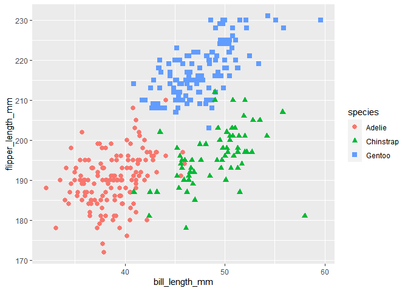

Homework 1
================
Siddarth Arumugam
September 2020

This is my solution to HW1

``` r
library(tidyverse)
```

## Problem 1

``` r
prob1_df = 
  tibble(
    samp = rnorm(10),
    samp_gt_0 = samp > 0,
    char_vec = c("a", "b", "c", "d", "e", "f", "g", "h", "i", "j"),
    factor_vec = factor(c("low", "low", "low", "mod", "mod", "mod", "mod", "high", "high", "high"))
  )
```

Take the mean of each variable in my data frame

``` r
mean(pull(prob1_df, samp))
```

    ## [1] 0.1314047

``` r
mean(pull(prob1_df, samp_gt_0))
```

    ## [1] 0.6

``` r
mean(pull(prob1_df, char_vec))
```

    ## Warning in mean.default(pull(prob1_df, char_vec)): argument is not numeric or
    ## logical: returning NA

    ## [1] NA

``` r
mean(pull(prob1_df, factor_vec))
```

    ## Warning in mean.default(pull(prob1_df, factor_vec)): argument is not numeric or
    ## logical: returning NA

    ## [1] NA

I can take the mean of numbers and logical but not character or factor

``` r
as.numeric(pull(prob1_df, samp))
```

    ##  [1]  0.5797285 -0.8409758  1.7994689  0.1823680 -0.7977682 -0.8166111
    ##  [7]  0.4827826  1.1509255  0.4184400 -0.8443112

``` r
as.numeric(pull(prob1_df, samp_gt_0))
```

    ##  [1] 1 0 1 1 0 0 1 1 1 0

``` r
as.numeric(pull(prob1_df, char_vec))
```

    ## Warning: NAs introduced by coercion

    ##  [1] NA NA NA NA NA NA NA NA NA NA

``` r
as.numeric(pull(prob1_df, factor_vec))
```

    ##  [1] 2 2 2 3 3 3 3 1 1 1

``` r
as.numeric(pull(prob1_df, samp_gt_0)) * pull(prob1_df, samp)
```

    ##  [1] 0.5797285 0.0000000 1.7994689 0.1823680 0.0000000 0.0000000 0.4827826
    ##  [8] 1.1509255 0.4184400 0.0000000

``` r
as.factor(pull(prob1_df, samp_gt_0)) * pull(prob1_df, samp)
```

    ## Warning in Ops.factor(as.factor(pull(prob1_df, samp_gt_0)), pull(prob1_df, : '*'
    ## not meaningful for factors

    ##  [1] NA NA NA NA NA NA NA NA NA NA

``` r
as.numeric(as.factor(pull(prob1_df, samp_gt_0))) * pull(prob1_df, samp)
```

    ##  [1]  1.1594569 -0.8409758  3.5989378  0.3647360 -0.7977682 -0.8166111
    ##  [7]  0.9655653  2.3018509  0.8368801 -0.8443112

## Problem 2

``` r
data("penguins", package = "palmerpenguins")
head(penguins)
```

    ## # A tibble: 6 x 8
    ##   species island bill_length_mm bill_depth_mm flipper_length_~ body_mass_g sex  
    ##   <fct>   <fct>           <dbl>         <dbl>            <int>       <int> <fct>
    ## 1 Adelie  Torge~           39.1          18.7              181        3750 male 
    ## 2 Adelie  Torge~           39.5          17.4              186        3800 fema~
    ## 3 Adelie  Torge~           40.3          18                195        3250 fema~
    ## 4 Adelie  Torge~           NA            NA                 NA          NA <NA> 
    ## 5 Adelie  Torge~           36.7          19.3              193        3450 fema~
    ## 6 Adelie  Torge~           39.3          20.6              190        3650 male 
    ## # ... with 1 more variable: year <int>

``` r
names(penguins)
```

    ## [1] "species"           "island"            "bill_length_mm"   
    ## [4] "bill_depth_mm"     "flipper_length_mm" "body_mass_g"      
    ## [7] "sex"               "year"

The dataset has 344 rows and 8 columns.

The mean flipper length in mm is 200.9152047 mm

``` r
ggplot(penguins, aes(x = bill_length_mm, y = flipper_length_mm)) + geom_point(na.rm = TRUE, aes(color = species, shape = species), size = 2.5)
```

<!-- -->

``` r
ggsave(filename = 'Scatter_Plot.pdf', plot = last_plot(), dpi = 600)
```

    ## Saving 7 x 5 in image
