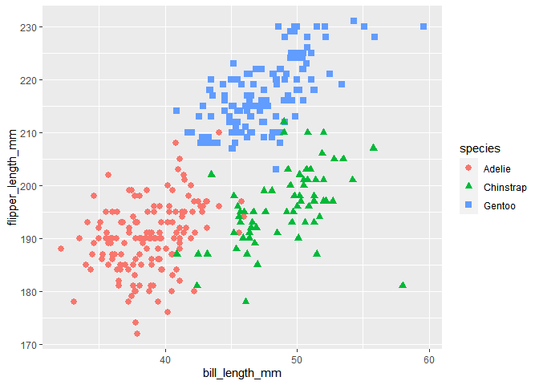

Homework 1
================
Siddarth Arumugam
September 2020

This is my solution to HW1

``` r
library(tidyverse)
```

## Problem 1

``` r
prob1_df = 
  tibble(
    samp = rnorm(10),
    samp_gt_0 = samp > 0,
    char_vec = c("a", "b", "c", "d", "e", "f", "g", "h", "i", "j"),
    factor_vec = factor(c("low", "low", "low", "mod", "mod", "mod", "mod", "high", "high", "high"))
  )
```

### Taking the mean of each variable in the data frame

``` r
mean(pull(prob1_df, samp))
```

    ## [1] 0.2653498

``` r
mean(pull(prob1_df, samp_gt_0))
```

    ## [1] 0.7

``` r
mean(pull(prob1_df, char_vec))
```

    ## Warning in mean.default(pull(prob1_df, char_vec)): argument is not numeric or
    ## logical: returning NA

    ## [1] NA

``` r
mean(pull(prob1_df, factor_vec))
```

    ## Warning in mean.default(pull(prob1_df, factor_vec)): argument is not numeric or
    ## logical: returning NA

    ## [1] NA

The means of numbers and logical are valid but not for characters or
factors

### Type conversion

``` r
as.numeric(pull(prob1_df, samp))
```

    ##  [1]  0.50183026  0.30092860 -0.83770346 -0.03656976  0.13514498  0.81611234
    ##  [7]  0.13913409  0.35938155 -1.03397930  2.30921862

``` r
as.numeric(pull(prob1_df, samp_gt_0))
```

    ##  [1] 1 1 0 0 1 1 1 1 0 1

``` r
as.numeric(pull(prob1_df, char_vec))
```

    ## Warning: NAs introduced by coercion

    ##  [1] NA NA NA NA NA NA NA NA NA NA

``` r
as.numeric(pull(prob1_df, factor_vec))
```

    ##  [1] 2 2 2 3 3 3 3 1 1 1

It is possible to convert numbers and logical values to their numeric
equivalents. The factor variable is converted into the numberical
equivalent of the 3 grades. Trying to convert the character vector
throws an error.

### Type conversion and multiplying with the random sample

``` r
as.numeric(pull(prob1_df, samp_gt_0)) * pull(prob1_df, samp)
```

    ##  [1] 0.5018303 0.3009286 0.0000000 0.0000000 0.1351450 0.8161123 0.1391341
    ##  [8] 0.3593815 0.0000000 2.3092186

``` r
as.factor(pull(prob1_df, samp_gt_0)) * pull(prob1_df, samp)
```

    ## Warning in Ops.factor(as.factor(pull(prob1_df, samp_gt_0)), pull(prob1_df, : '*'
    ## not meaningful for factors

    ##  [1] NA NA NA NA NA NA NA NA NA NA

``` r
as.numeric(as.factor(pull(prob1_df, samp_gt_0))) * pull(prob1_df, samp) 
```

    ##  [1]  1.00366053  0.60185719 -0.83770346 -0.03656976  0.27028995  1.63222468
    ##  [7]  0.27826817  0.71876310 -1.03397930  4.61843724

Converting the logical vector to a numeric made it possible to multiply
it with the random sample. Converting it to a factor, however resulted
in an error when multiplying with the random sample. Converting the
factor to a numeric allowed the arithmetic operation.

## Problem 2

``` r
data("penguins", package = "palmerpenguins")
head(penguins)
```

    ## # A tibble: 6 x 8
    ##   species island bill_length_mm bill_depth_mm flipper_length_~ body_mass_g sex  
    ##   <fct>   <fct>           <dbl>         <dbl>            <int>       <int> <fct>
    ## 1 Adelie  Torge~           39.1          18.7              181        3750 male 
    ## 2 Adelie  Torge~           39.5          17.4              186        3800 fema~
    ## 3 Adelie  Torge~           40.3          18                195        3250 fema~
    ## 4 Adelie  Torge~           NA            NA                 NA          NA <NA> 
    ## 5 Adelie  Torge~           36.7          19.3              193        3450 fema~
    ## 6 Adelie  Torge~           39.3          20.6              190        3650 male 
    ## # ... with 1 more variable: year <int>

The dataset has column names that are \[species, island,
bill\_length\_mm, bill\_depth\_mm, flipper\_length\_mm, body\_mass\_g,
sex, year\]. The dataset represents the different species of penguins
and their physical attributes (bill length in mm, bill depth in mm,
flipper length in mm, body mass index, sex) and the islands they are
found on. The dataset has 3 species of penguins found on 3 islands.

The dataset has 344 rows and 8 columns.

The mean flipper length in mm is 200.9152047 mm

``` r
ggplot(penguins, aes(x = bill_length_mm, y = flipper_length_mm)) + geom_point(na.rm = TRUE, aes(color = species, shape = species), size = 2.5)
```

<!-- -->

``` r
ggsave(filename = 'Scatter_Plot.pdf', plot = last_plot(), dpi = 600)
```

    ## Saving 7 x 5 in image
